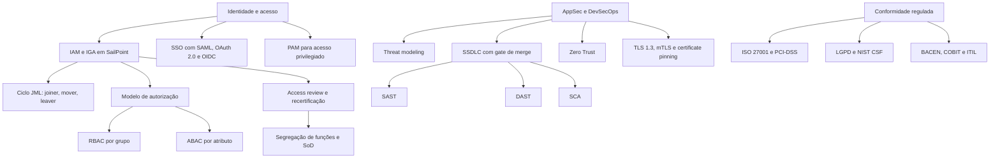
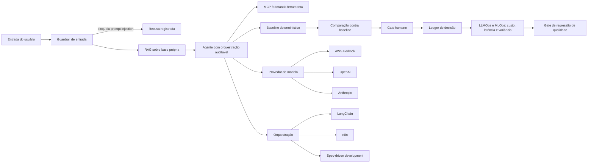
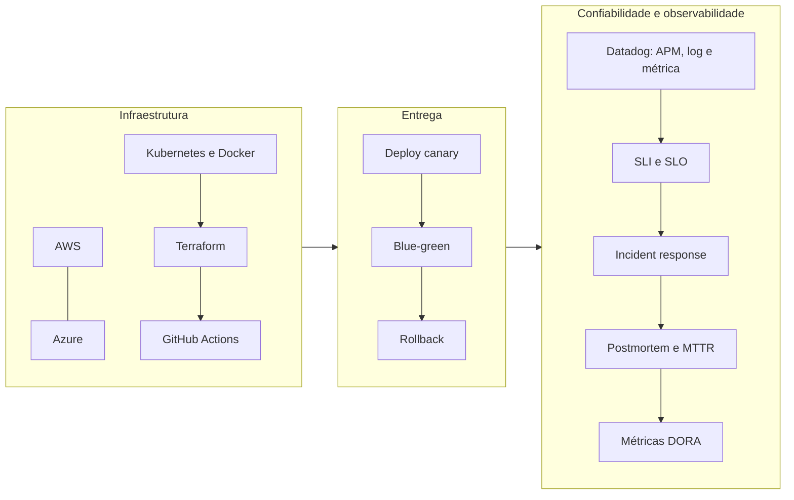
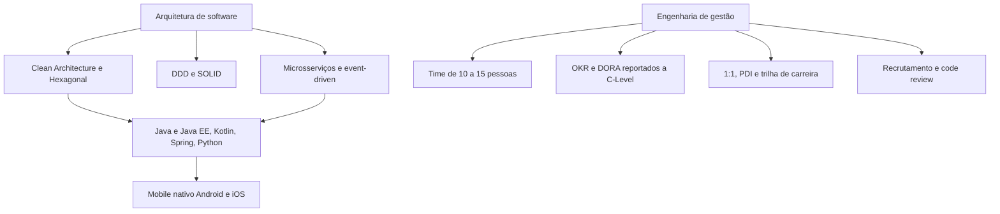

# Juliano Vince de Campos

**Staff / Principal Architect** &nbsp;·&nbsp; **Engineering Manager** &nbsp;·&nbsp; **Cibersegurança** &nbsp;·&nbsp; **AI Engineering**

Arquitetura, segurança e confiabilidade em fintech e banking sob regulação. 18 anos em tecnologia, 9 deles em cibersegurança. O que está aqui roda com um comando, em máquina limpa, sem chave de API e sem conta em nuvem.

<table>
<tr>
<td width="34%" valign="top">

**Base** 
Brasil, São Paulo e Goiás

</td>
<td width="33%" valign="top">

**Setor** 
Fintech, banking e pagamentos

</td>
<td width="33%" valign="top">

**Todo repositório** 
Commit assinado, histórico linear

</td>
</tr>
</table>

✡︎ <strong>אֱמֶת</strong> 
<em>emet</em>, verdade. O que um sistema diz quando ninguém está olhando.

---

## O que você encontra aqui

Sistemas pequenos e completos, cada um isolando um problema difícil de um domínio que eu opero no dia a dia: leitura de causa raiz em legado, governança de acesso, e IA aplicada com régua.

Cada número que aparece num README é calculado pelo próprio projeto e defendido por CI, então continua verdadeiro no commit seguinte.

---

## Projetos em destaque

### [postmortem-miner](https://github.com/JulianoVinceCampos/postmortem-miner)

Histórico de incidente virando decisão de triagem. Minera padrão recorrente em postmortem e devolve a árvore de decisão que um plantonista usa às 3h da manhã. Baseline determinístico primeiro, modelo depois, e só se a medição mostrar ganho.

<table>
<tr>
<td width="25%" align="center"><strong>8 padrões</strong> explicam 90% de 20 incidentes</td>
<td width="25%" align="center"><strong>15 ms</strong> latência de triagem</td>
<td width="25%" align="center"><strong>93 testes</strong> suíte automatizada</td>
<td width="25%" align="center"><strong>99%</strong> cobertura</td>
</tr>
</table>

### [shomer-oncall](https://github.com/JulianoVinceCampos/shomer-oncall)

Escala de plantão que respeita calendário hebraico sem penalizar ninguém. As fronteiras de turno saem de *zmanim* astronômicos calculados na hora, não de tabela chumbada. O allocator reparte carga ponderada entre quem observa e quem não, e prova a justiça com métrica.

<table>
<tr>
<td width="25%" align="center"><strong>0,9998</strong> índice de justiça de Jain</td>
<td width="25%" align="center"><strong>0 violações</strong> em escala de 92 dias</td>
<td width="25%" align="center"><strong>77 testes</strong> suíte automatizada</td>
<td width="25%" align="center"><strong>96%</strong> cobertura</td>
</tr>
</table>

Calendário hebraico e *zmanim* implementados do zero, com zero dependência de runtime.

### [iam-governance-lab-web](https://github.com/JulianoVinceCampos/iam-governance-lab-web)

Governança de acesso que nomeia a procedência de cada achado. SoD, privilege reachability cross-account, ciclo JML e recertification sobre dataset sintético multi-conta. Cada violação diz quais dois entitlements colidem e qual cadeia de grupo os trouxe. Cada escalonamento imprime o caminho inteiro, aresta por aresta.

<table>
<tr>
<td width="25%" align="center"><strong>37 violações</strong> de SoD, em 4 severidades</td>
<td width="25%" align="center"><strong>12 caminhos</strong> de escalonamento cross-account</td>
<td width="25%" align="center"><strong>64 testes</strong> em Python 3.11 a 3.14</td>
<td width="25%" align="center"><strong>Demo</strong> <a href="https://iam-governance-lab-web.onrender.com">no ar</a></td>
</tr>
</table>

Dashboard interativo, editor de cenário e restore em um clique. CI com Semgrep, CodeQL e pip-audit.

<strong>Em construção</strong>, cada um ligado a uma competência específica

 

| Projeto | Domínio | O que resolve |
|---|---|---|
| `llm-eval-gate` | LLMOps e guardrail | Gate de CI que reprova o PR quando a qualidade da saída do LLM regride. Spec executável, variância entre execuções, orçamento de custo e latência, comparação contra baseline determinístico |
| `ledger-forensics` | Criptografia aplicada e PKI | Detecção de fraude em escrituração com ground truth injetado, cadeia de hash tamper-evident, validação de XMLDSig e Autoridade Certificadora de teste própria |
| `dora-lens` | Gestão de engenharia com dado | As quatro métricas DORA direto da API do GitHub, com cada definição e cada caso de borda escritos, para o número significar a mesma coisa em toda leitura |
| `bulk-ingest-lab` | Performance em stack legada | Ingestão monolítica virando streaming com chunking transacional, medida em JMH e com gate de regressão de memória |

---

## O padrão de engenharia

Todo repositório nasce com a mesma esteira, e ela é bloqueante. A cobertura tem ratchet, ou seja, só sobe. CodeQL bloqueia merge.

```mermaid
flowchart LR
  A["Sanitização de segredo"] --> B["Lint e format"]
  B --> C["Teste em matriz de versão"]
  C --> D["Cobertura com ratchet"]
  D --> E["SAST Semgrep"]
  E --> F["CodeQL bloqueante"]
  F --> G["SCA de dependência"]
  G --> H["Quality gate SonarQube"]
  H --> I["SBOM"]
  I --> J["Atestação de proveniência"]
  J --> K["Merge liberado"]
```

---

## Impacto em produção

| Frente | Resultado |
|---|---|
| **Pagamentos**  PagoNxt / Santander | Sucesso transacional de **65% para 92%** em 8 meses · MTTR de **2h40 para 18 min** · falhas críticas **-60%** |
| **Engenharia e DORA**  Luby | Cobertura de teste **0 para 82%** em 3 meses · lead time **14 dias para 2** · cycle time **5 dias para 8h** · change failure rate **25% para 5%** |
| **IAM e IGA**  Creditas | **-45%** em acesso acima do necessário · provisionamento de dias para horas (**-60%**) · **-28%** em incidente de autenticação e permissão |
| **Segurança em banking**  Itaú Unibanco | **-42%** em privilégio excessivo · remoção de acesso de 5 dias para **menos de 48h** · **-33%** no esforço de auditoria BACEN e LGPD |
| **Mobile em escala LATAM**  Mercado Pago | Falhas críticas **-55%** · MTTR **-60%** · incidente em produção **-40%**, em 4 países |
| **FinOps e arquitetura**  Compass UOL | Custo de cloud **-20% a -35%** mantendo alta disponibilidade |

O contexto de cada frente está no <a href="https://www.linkedin.com/in/julianovincecampos/">LinkedIn</a>.

---

## Domínios técnicos

Cada mapa abaixo é uma frente que eu opero. Estão como diagrama e não como lista porque a relação entre os elementos é parte da competência.

### Cibersegurança e identidade

### IA aplicada, com guardrail e medição

### Plataforma e confiabilidade

### Arquitetura e engenharia de gestão

---

## Como eu construo

Quatro decisões aparecem em tudo que eu entrego, e são o que eu levo para um time.

<table>
<tr>
<td width="50%" valign="top">

**Baseline determinístico antes de qualquer IA**

Primeiro a solução explicável, depois a medição de quanto o modelo agrega sobre ela. Nessa ordem. Num incidente às 3h da manhã, o que serve é uma conclusão com a qual se pode discutir, não um score no qual se precisa acreditar.

</td>
<td width="50%" valign="top">

**Ground truth plantado de propósito**

Os geradores de dado sintético injetam o problema que a detecção precisa achar, e é isso que torna precisão e recall calculáveis em vez de estimados.

</td>
</tr>
<tr>
<td width="50%" valign="top">

**Escopo declarado antes da conclusão**

O que o modelo não avalia fica escrito acima do resultado. Limite conhecido é engenharia, limite implícito é armadilha para quem lê depois.

</td>
<td width="50%" valign="top">

**Segurança como propriedade da arquitetura**

Não etapa, não checklist, não gate no fim da esteira. Quando ela só aparece antes do deploy, o custo de mudar já está travado.

</td>
</tr>
</table>

---

## Trajetória

**Hoje**, Engineering Staff, AI Engineering Lead, SRE e Cibersegurança na **Luby**. Fábrica de software com agentes de IA auditáveis, spec-driven development, guardrail por hook, MCP federando ferramentas, RAG e LLMOps. Threat modeling voltado a LLM: prompt injection, data leakage, exfiltração.

**Antes**: Creditas · Compass UOL · PicPay · PagoNxt (Santander) · Mercado Pago · Itaú Unibanco · Foursys · Soluti (Autoridade Certificadora).

**Da camada física à governança.** Comecei em suporte N1, N2 e N3 em telecom, passei por gestão de infraestrutura on-premise, desenvolvimento backend, mobile Android e iOS, e entrei em cibersegurança numa Autoridade Certificadora, onde confiança, criptografia e conformidade *são* o produto. Camada por camada, do hardware ao código à governança. É daí que vem a leitura de ponta a ponta.

---

## Formação e certificações

<table>
<tr>
<td width="55%" valign="top">

**Formação**

**Cambridge AI Leadership Programme** 
University of Cambridge, 2026

**Pós-graduação em Cibersegurança e Governança de Dados** 
PUC Minas

**MBA em IA, Data Science e Big Data** 
PUC-RS

**Especialização em Gestão de Engenharia** 
PUC Minas

**Bacharelado em Sistemas de Informação** 
PUC Goiás

</td>
<td width="45%" valign="top">

**Certificações**

AWS Certified AI Practitioner 
Fundamentos de IA e serviços gerenciados em AWS

Oracle Certified Java Programmer 
Linguagem Java e plataforma JVM

ITIL v3 Foundation 
Gerenciamento de serviço de TI

EXIN ISO/IEC 27002 
Controles de segurança da informação

COBIT 
Governança e auditoria de TI

</td>
</tr>
</table>

---

✡︎ <strong>בְּעֶזְרַת הַשֵּׁם</strong> 
Brasil, SP e GO · <a href="https://julianovincedecampos.com/">julianovincedecampos.com</a> · <a href="https://www.linkedin.com/in/julianovincecampos/">LinkedIn</a> · Perfil anterior: <a href="https://github.com/JulianoVince">@JulianoVince</a>
